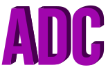

  
  
  
 

 

<b>@adrianaluisadc:</b>
  
  
 :gem: Full-stack Designer :dart: Self-taught Front-end Developer :books: Novelist / Writer :art: Digital Artist

 

  
 

 
  
 
  
  
 
 

 

 <b>Tools and Technologies</b>
  
  
 
 
 
 
 
 
 
 
 
 
 
 
 
  
  
 <b>Affiliated Organizations and Communities</b>
  
  
 
 
 
 
 
  
  
 <b>Account Links</b>
  
  
 
 
 

